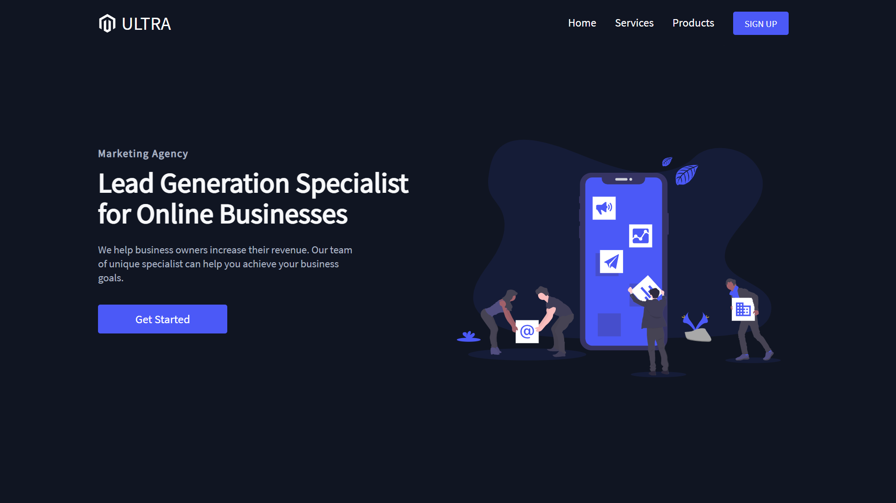
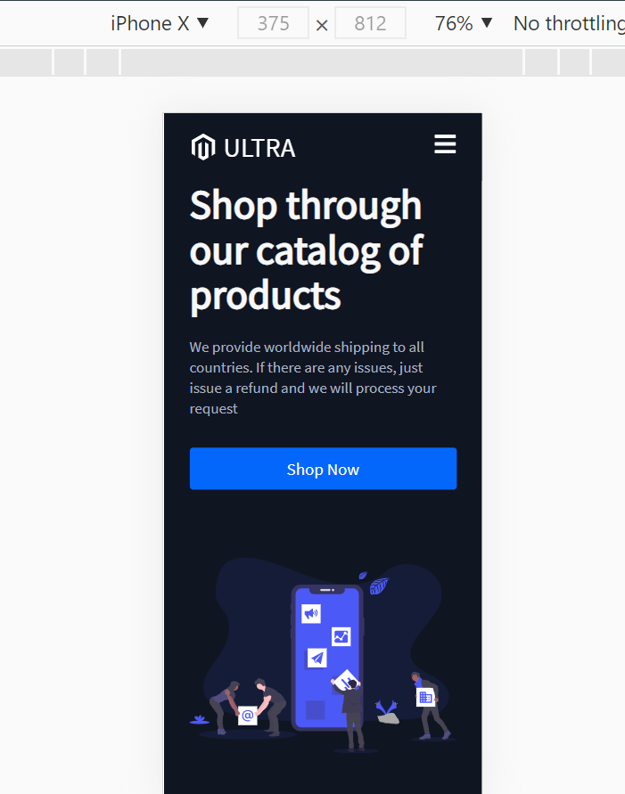

# Product Landing Page Template

This gorgeous responsive website is a static landing page built with React, styled components, react-router, and react hooks. All the components are reusable and can be used for any dynamic content. It's fully responsive for all the platforms and hosted using Netlify

# Description 

This static landing page could be used for various product showcases. You can navigate to different pages possibly due to react-router. I always wanted to learn styled components and building a project is a practical way to learn.
The only challenge I faced was using styled components, it was intimidating at first and since I used regular CSS and SASS it was weird without any classnames. At least styled-components are similar to SASS in terms of nesting lol! 

I referred to this doc for understanding styled components - [styled component doc](https://styled-components.com/).

[Click here to see the live demo](https://ultra-b73fc5.netlify.app/)

# Tech Stack
* React
* Styled Components
* React Router
* React Hooks

# Screenshot

# Credits
@briandesign
